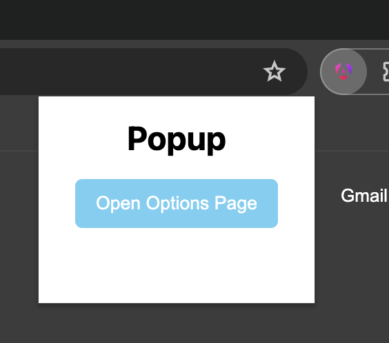
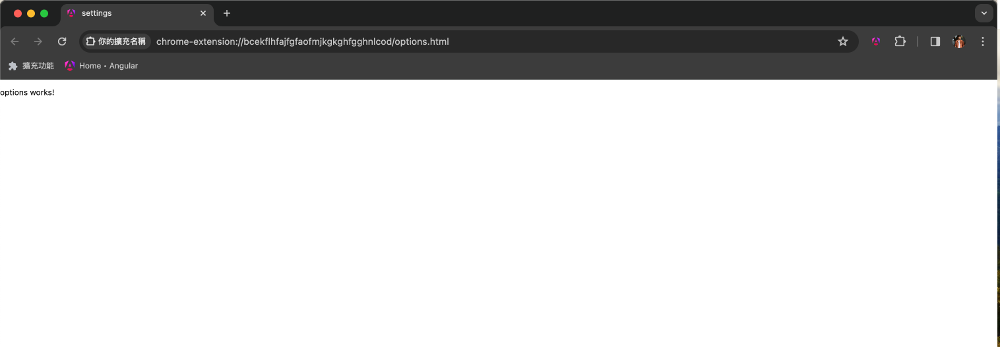

# ngx-chrome-extension-live-reload

這是一個 Angular 的 schematics，可快速配置 Chrome Extension 的開發環境，讓你在開發時，可以自動 reload Chrome Extension。

## 使用方式

```bash
ng new my-app
cd my-app
ng add ngx-chrome-extension-live-reload
npm start
```

```bash
// 產出上架的 zip 檔案
npm run build:extension
```

## 說明

此 schematics 會幫你做以下事情：

- 安裝本地開發 chrome extension 所需套件。
- `package.json` 增加開發與打包所需的 scripts。
- 增加 chrome extension 所需的 `manifest.json`、`content-script.js`、`background.js`。
- 增加 goToTop component，作為示範。
- 增加 popup component，作為示範。
- 增加 options component，作為示範。
- 調整 `angular.json` 的 `build` 的相關設定。
- 配置 開發所需的 webpack。

## goToTop component

在 chrome / edge 新增 extension 成功後。


可到 [angular.dev](https://angular.dev/) 測試，如右下角有出現按鈕，即代表成功。


## popup 示範 (2024/04/02 新增)



## options 示範 (2024/04/02 新增)



## 示範影片 (使用 ng 17.0.0 新增)

[示範 ngx-chrome-extension-live-reload](https://youtu.be/_xsc8oIJoDk?si=vinYUIgEN7ntO0Gj)
